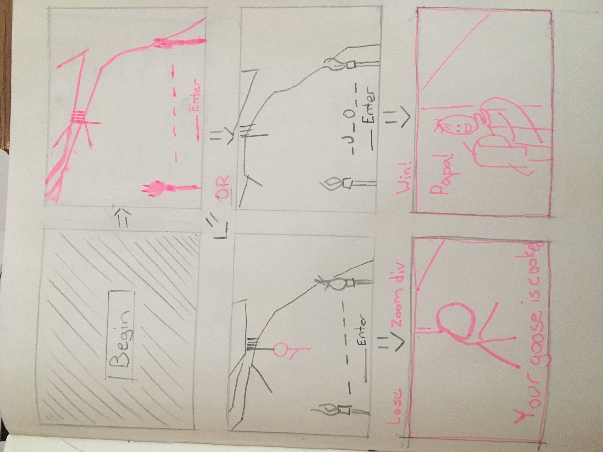

 Alexander Calleia July 11, 2017

# Hangman: A Dark Day Proposal

## What is Hangman: A Dark Day?

I would like to create a classic hangman game. The player will input letters to try and spell out a hidden word but they must guess the letters carefully or they will lose. I wanted to make the game because it's game rules are well defined. I hope to finish the game logic early to allow myself time to really develop the motifs of the 'Dark Day' theme.  

## Wireframe

## 

## Initial thoughts on game structure

I expect to encounter some difficulties creating a variable of arrays or divs to show up when a random word is picked from my word library. I also may run in to trouble animating everything I want to.

## Phases of Completion

Phase 0 - create library of words and make a way to pull a word from it randomly and subsequently broken into an array of letters. This 

## Links and Resources

(Anything you've looked up so far or are thinking about using.)
